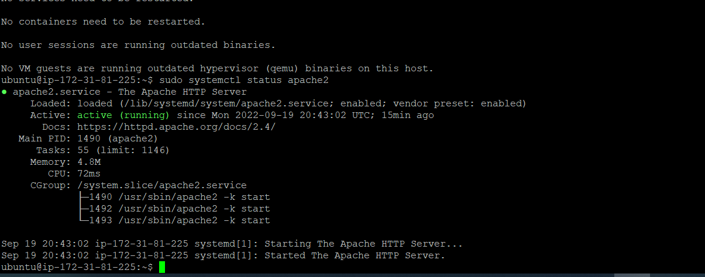

## My Documentation for Project_01

### Apache service installation

`sudo apt update`

`sudo apt install apache2`

`sudo sytemctl status apache2`

*set default rule in security group on AWS to allow traffic from any IP address on all port. Screenshot confirming server is reachable from public network*

### Apache service reachablity

`curl http://localhost`

`curl http://localhost:80`

`curl http://127.0.0.1`

*Apached server reachable from internet using http://44.202.14.70 on a browser of another machine*

`curl -s http://169.254.169.254/latest/meta-data/public-ipv4`

### MYSQL installation

`sudo apt install mysql-server`

`sudo mysql`

`ALTER USER 'root' @'localhost' IDENTIFIED WITH mysql_native_password BY 'PassWord.1';`

`exit`

`sudo mysql_secure_installation`

### PHP installation

`sudo apt install php libapache2-mod-php php-mysql`

`php -v`

`sudo mkdir /var/www/projectlamp`

`sudo chown -R $USER:$USER /var/www/projectlamp`

`sudo vi /etc/apache2/sites-available/projectlamp.conf`

*vitual host creation shown below in VIM*

`<VirtualHost *:80>
    ServerName projectlamp
    ServerAlias www.projectlamp 
    ServerAdmin webmaster@localhost
    DocumentRoot /var/www/projectlamp
    ErrorLog ${APACHE_LOG_DIR}/error.log
    CustomLog ${APACHE_LOG_DIR}/access.log combined
</VirtualHost>`

`sudo ls /etc/apache2/sites-available`

`sudo a2ensite projectlamp`

`sudo a2dissite 000-default`

`sudo apache2ctl configtest`

`sudo systemctl reload apache2`

`sudo echo 'Hello LAMP from hostname' $(curl -s http://169.254.169.254/latest/meta-data/public-hostname) 'with public IP' $(curl -s http://169.254.169.254/latest/meta-data/public-ipv4) > /var/www/projectlamp/index.html`

*accessing the URL via the public IP address*

### Enabling PHP on website

`sudo vim /etc/apache2/mods-enabled/dir.conf`

*modification on the DirectoryIndex directive, commented our the default directive while leaving the modified one*

`<IfModule mod_dir.c>
        #Change this:
        #DirectoryIndex index.html index.cgi index.pl index.php index.xhtml index.htm
        #To this:
        DirectoryIndex index.php index.html index.cgi index.pl index.xhtml index.htm
</IfModule>`

`sudo service apache2 reload`

`vim /var/www/projectlamp/index.php`

*access the php page using the public IP address to confirm php installation was successful*

#command to to remove the new file named index.php

`sudo rm /var/www/projectlamp/index.php`

